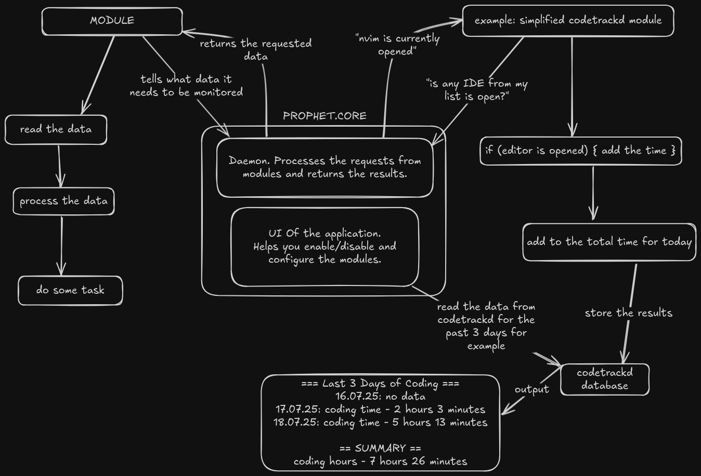

> ⚠️ **Early Stage / Work in Progress:** Prophet.Core is just getting started. Architecture may change, modules are minimal.

# Prophet.Core 
is a local daemon that serves as a central hub for modules that help collect personal statistics or automate tasks. Modules can be easily modified by the user through the GUI. Statistics collected by the modules can also be viewed through the GUI. The core itself does nothing until you attach modules, which contain the logic for using the data retrieved from the core. The core returns only the data that each module requests in its module.json allowing user to see what's exactly is being monitored.

*Sample module "codetrackd"* - communicates with the Core to check whether application like nvim or vim are open. After the request from module is created - daemon(the core) start its work. Based on the Core's response the module executes its logic, in this case is a simple time tracking while the editor is opened to provide your personal statistics.

# Why?
I wanted to collect my own statistics for fun, self-review and productivity purposes, but managing multiple daemons and rewriting similar logic for each was inconvenient. I needed a single place to configure and view everything.

### Architecture


# Build & Run
### Compile module
Navigate to its folder first (`modules/module_name`) and run the following universal command:
```bash 
find . -name "*.cpp" -exec bash -c 'f="{}"; g++ -fPIC -shared -I../../include -o "${f%.cpp}.so" "$f"' \;
```

### Compile core
```bash
mkdir build
cd build
cmake ..
make
```

### Compile gui
```bash
mkdir gui/build
cd gui/build
cmake ..
make
```
